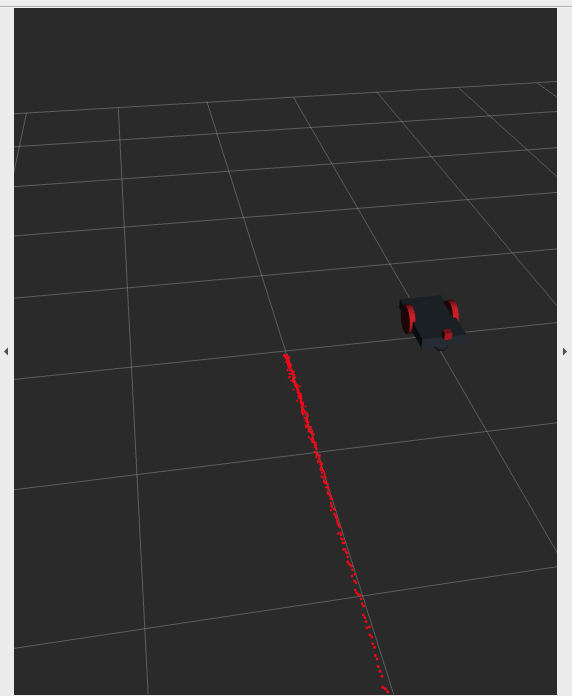
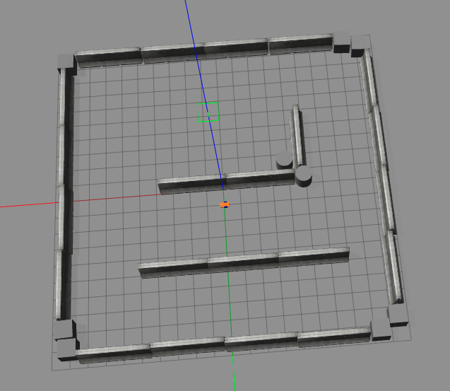

Second assignment
================================

This is a possible implementation of the second assignment of Reaserch Track 2 couse. 

The goal of this assignment is to modify the second assignment did in Research track 1 course, using Jupyte notebook. 

Installing
----------------------

To run this assignment it is necessary to have **ROS noetic** version installed. The simplest way is to have the [**Docker**](https://docs.docker.com/get-docker/) and then follow this [**ROS guide**](http://wiki.ros.org/ROS/Installation).

It is necessary to have installed **Firefox** browser, **Jupyter Notebook**, and all the related extensions.

It is also necessary to create a workspace and named it `/my_ros`. You can find how to create a workspace on [wiki.ros.org](http://wiki.ros.org/catkin/Tutorials/create_a_workspace).

How to run
----------------------

To launch the assignment is necessary to clone the GitHub repository using:

```bash
git clone https://github.com/VeronicaG24/assignment2_RT2.git
```

and move all the content into the folder `/my_ros/src`.
Then from the workspace, compile using:

```bash
catkin_make
```

Now, open two different terminal windows and move into `/my_ros` workspace.
In the first terminal, launch **Gazebo** and **Rviz** simulations using  the following command:

```bash
roslaunch assignment_2_2022 assignment1.launch
```

Two windows of **Gazebo** and **Rviz** will be spawed:

<table><tr>
    <td>  </td>
    <td>  </td>
</tr>
<tr>
    <td>Rviz window</td>
    <td>Gazebo window</td>
</tr>
</table>

And then, from the other terminal, run the command:

```bash
jupyter notebook --allow-root
```
A Firefox page should open, othewise open a page and navigate to  `localhost:8888`.

Then navigate into the folder `/my_ros/src/assignment2_RT2/assignment_2_2022` and oper the file named `Assignment_2_rt2.ipynb`.

Requirements
----------------------

The code is designed to respect the following requirements:

* The notebook should have:
    1. Some button for handling the motion of the robot in the environment;
    2. A plot with the robot's position and targets' position in the environment;
    3. A text box with the distance of the closest obstacle;
    4. A plot for the number of the reached/deleted targets;

Description of the code
----------------------

To run the code is necessary to run each box per time. After running the fourth part of the code, a menu to insert the coordinates of the goal is shown.
Befor running the other part, you need to insert the coordinate and send it by clicking on the button confirm.

Then you can run all the others and see the graphs.

Using the menu you can confirm or delete a goal, and all the graphs will be updated.

<table><tr>
    <td>  </td>
</tr>
<tr>
    <td>Menu window</td>
</tr>
</table>

The graphs shown represent the trajectory or the right and the number of reached/deleted goals om the left.

<table><tr>
    <td>  </td>
</tr>
<tr>
    <td>Graphs</td>
</tr>
</table>

Under the graphs, three text boxes are shown for the distance from the closest obstacles, and the actual x-y coordinates of the robot.

<table><tr>
    <td>  </td>
</tr>
<tr>
    <td>Distance from the obstacles, x-y coordinates</td>
</tr>
</table>
